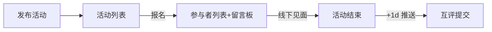

_最后更新：2025‑05‑27_

---

## 0. 文档概览

|条目|内容|
|---|---|
|**产品名称**|**ClimberDaz** – 攀岩找搭子小程序|
|**目标版本**|MVP 1.0（8 周冲刺）|
|**核心闭环**|**发布 ▸ 报名/取消 ▸ 线下见面 ▸ 次日互评**|
|**主要新增**|标题栏、见面模式、隐私开关、官方公告、个人信息卡|
|**负责人**|PO：xxx|
|技术：yyy||
|设计：zzz||

---

## 1. 背景 & 目标

- **痛点**：攀岩爱好者缺固定搭子，需要频繁跳转微信群；信息分散、鸽子率高。
    
- **使命**：在微信生态内，用最轻路径完成约局并留下可用的历史评价，为下一次找队友提供决策依据。
    

---

## 2. 关键价值指标 (KVI)

|指标|目标|
|---|---|
|局发布→完赛闭环率|≥ 70 %|
|人均报名取消率|≤ 15 %|
|有效互评覆盖率|≥ 60 %|
|W1 留存|≥ 40 %|

---

## 3. 用户 & 典型故事

### 3.1 Personas

|Persona|画像与需求|
|---|---|
|**A. 都市白领**25‑35 岁|周末练抱石，想提前约好靠谱队友|
|**B. 进阶玩家**18‑30 岁|关注难度和绳索保护，想找实力接近的伙伴|
|**C. 新手小白**18‑25 岁|初学，需要有人带练，担心鸽子|

### 3.2 核心用户故事

|#|角色|叙述|
|---|---|---|
|US‑01|发起人|“我想 1 分钟建局并写个帅气标题，设置集合方式，让人立即报名。”|
|US‑02|参与者|“我想按日期、类型、难度筛选活动并一键报名，无需等待确认。”|
|US‑03|参与者|“若临时有事，我要能在开局前 30 分钟取消。”|
|US‑04|发起人|“若局开不成，我能在开局前≥2 小时取消并自动通知所有人。”|
|US‑05|查看资料|“点击头像时，我希望看到对方过往评价、装备与参与概况。”|
|US‑06|官方运营|“我要在首页发布滚动公告，推送活动规则或优惠。”|

---

## 4. 用户旅程 & 场景流程



### 4.1 发布

_字段：_ **标题、时间、地点 (POI)、见面模式、类型(多)、难度(多)、装备(多)、费用、名额、隐私开关**  
_隐私逻辑：_ `is_private = 1` 时，当达到满员或进入开始时间即从公共列表隐藏，仅 host 与参与者可访问。

### 4.2 报名与取消

|操作|限制|反馈|
|---|---|---|
|报名|名额锁＋并发校验|服务通知给发起人|
|取消报名|开局前 ≤ 30 min|服务通知给发起人|
|发起人删除活动|开局前 ≥ 2 h|服务通知全部报名者；主页打 “已取消” 灰条|

### 4.3 互评

- **推送时间**：活动结束次日 10:00
    
- **维度**：守时、技术、氛围、安全（1‑5★）+ 文本 ≤ 80 字
    
- **窗口**：48 h，逾期标 “未评价” 不计入统计
    

---

## 5. 功能需求 (FR)

|模块|需求编号|描述|
|---|---|---|
|**发布活动**|FR‑1|标题必填 ≤ 20 字|
||FR‑2|见面模式字段 `meet_mode` (0=门口集合; 1=先到先攀)|
||FR‑3|隐私开关 `is_private`|
||FR‑4|其余字段见 §4.1|
|**浏览/筛选**|FR‑5|列表默认不返回 `is_private=1` 活动|
||FR‑6|按日期→距离→时间排序|
|**留言板**|FR‑7|评论限 100 字，30 s 频率|
|**个人信息卡**|FR‑8|展示头像、昵称、Level、参与统计、好/差评标签、最近 3 条评价、装备徽章|
|**首页公告**|FR‑9|顶部滚动展示 ≤ 3 条 `announcement`；支持跳转详情|
|**通知系统**|FR‑10|服务通知：报名/取消/删局 订阅消息：开局前 1 h、互评提醒|
|**内容安全**|FR‑11|标题/评论/公告走腾讯云文本审查；图片审查预留|

---

## 6. 非功能需求 (NFR)

|类别|指标|
|---|---|
|**性能**|列表接口 ≤ 300 ms；并发报名 TPS ≥ 200|
|**兼容**|微信基础库 ≥ 2.32；Android 8+、iOS 13+|
|**安全**|HTTPS；JWT + openid 鉴权；SQL 注入 & XSS 防护|
|**可运维**|Prometheus + Grafana 监控 BullMQ 重试 & 告警|
|**隐私**|不存储手机号；遵守《微信小程序平台运营规范》|

---

## 7. 技术栈

|层级|选型|备注|
|---|---|---|
|**小程序端**|Taro 4 + React (TS)、Vant Weapp、Zustand、Swiper|可输出 H5|
|**地图/定位**|腾讯 Location SDK|精确距离排序|
|**后端**|NestJS 10、MySQL 8、Redis 7、Socket.IO|REST + WS|
|**存储/内容安全**|Tencent COS、Text/Img Moderation API||
|**任务队列**|BullMQ (Redis) – 互评定时推送||
|**CI/CD**|GitHub Actions → Docker → K8s (TKE)||
|**监控**|Prometheus, Grafana, Loki||
|**测试**|Jest / Supertest、Cypress||

---

## 8. 数据模型（核心表）

```sql
user(openid PK, nickname, avatar, level, gear_tags JSON, created_at)

activity(id PK, host_id FK, title, datetime, location_txt, lat, lng,
         meet_mode TINYINT, is_private TINYINT,
         types JSON, grades JSON, gears JSON,
         cost_mode TINYINT, slot_max, status TINYINT, created_at)

participation(activity_id, user_id, join_time, cancel_time NULL,
              PRIMARY KEY(activity_id,user_id))

comment(id PK, activity_id, user_id, content, ts)

review(id PK, activity_id, from_user, to_user,
       punctual, skill, vibe, safety, comment, ts)

announcement(id PK, title, content, start_at, end_at, weight, created_at)
```

---

## 9. 里程碑 & 验收

|Sprint|目标|完成判定|
|---|---|---|
|**S1 (周1‑2)**|发布/列表 API + UI（含标题/见面模式）|建局后列表可见|
|**S2 (周3‑4)**|报名/取消/删局 + 隐私逻辑|并发报名无超员，隐私活动按规则隐藏|
|**S3 (周5)**|留言板 + 内容审查|违规词拦截率 ≥ 95 %|
|**S4 (周6)**|互评 + 个人信息卡|次日推送到达率 ≥ 90 %|
|**S5 (周7)**|公告 CMS + 滚动条|后台可增删改，前端实时生效|
|**S6 (周8)**|公测 & 埋点|KVI 达标，P0 bug < 5|

---

## 10. 主要风险 & 应对

|风险|级别|Mitigation|
|---|---|---|
|滥用留言/恶意报名|中|文本审查 + 频控 + 举报通道|
|名额并发超抢|中|Redis 分布式锁、幂等校验|
|通知授权率低|低|发布页强提醒 + 首页 Banner 教程|
|隐私活动访问绕过|低|服务端二次鉴权 (host or participant)|

---

## 11. 待决议事项

1. **昵称/头像修改频率** 是否限制？
    
2. **私信功能** 计划留到 P2，是否需预留路由？
    
3. **等级 (Level) 算法** 使用自填 or 互评派生？（产品评审会敲定）
    

---

> **本 PRD 在 v1.0 版本锁定范围内，后续新增需求请提交变更记录并递增版本号。**